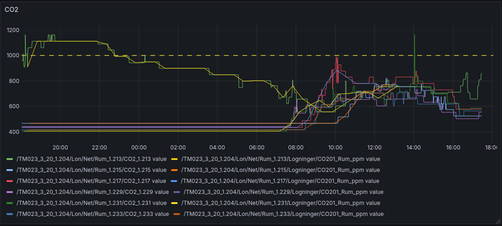

# ESUS-TMV23
Work-in-progress project on saving heating/cooling costs in the AAU TMV23 building.

The goal is to synthesise control strategies (Imran papers) for a subset of the TMV23 building and apply this through manipulating temperature-setpoints and actuating external window shades.
Presumed savings are among others from utilising weather forecasts and preemptively lowering shades in morning on sunny days to save cooling costs on south-facing rooms. Currently, these shades are not tied into the main BMS and are only controlled by human interaction.

Example of visualisation of production data in Grafana from BMS API:



# TODO:
- Fixup wrapper.out emission from systemd service
- Map missing externallogids: {696837, 696838, 696840, 696841, 696842, 730988}
- Improve reliability of BMS API
    - Failed externallogids seems to increase with wider timeframe in request (?!?). We have seen the reverse be true before.
- Implement method for gathering some timedelta back with error-handling to ensure integrity within the timeframe.
    - Requires some form of missing value detection with variable sampling-frequency time data. PoC: Just do upper bound of reasonable frame.

# Prod setup
- Assumes standard Ubuntu 24.04 VM (use e.g. Strato)
- Assumes paths used in `systemd/esus-wrapper.service`
    - Copy service to `/etc/systemd/system/esus-wrapper.service` on VM 
- Setup venv according to `requirements.txt`
- Setup docker and `docker compose up -d` to start InfluxDB and Grafana
- Start+enable the wrapper `systemctl enable --now esus-wrapper`

# Performance
- Reading from BMS API all measurements for one day takes ~1m20s
- Writing transformed points to local InfluxDB instance takes 16s to precompute, and 10s (preliminary) to write to db.
    - Extrapolating this means that we consume 1 time unit of computation per 1000 time units monitored. Polling once every 15 minutes (0/15/30/45 minutes + epsilon) can expose measurements as soon as they're available.

# Limitations
- Shades are not digitally controllable (LK svagstrømstryk installed) without custom hardware. 
- Main BMS (Schneider Electrics) is run on old bus which cannot handle much bandwidth. Limited to update frequency of ~5mins.
- BMS API fails mapping for following `externallogids`:
```csv 
source_df source_df.index[i]=34, source_df[logmap_var_name][i]='Lux_level_ceiling__1.215' failed
source_df source_df.index[i]=36, source_df[logmap_var_name][i]='Vindue_1.215' failed
source_df source_df.index[i]=73, source_df[logmap_var_name][i]='Vindue_1.217' failed
source_df source_df.index[i]=98, source_df[logmap_var_name][i]='Vindue_1.229' failed
source_df source_df.index[i]=123, source_df[logmap_var_name][i]='Vindue_1.231' failed
source_df source_df.index[i]=148, source_df[logmap_var_name][i]='Vindue_1.233' failed
```

# Progress
- Refactor API to higher standard; error-handling, proper export of time-series, and speedup (python wrapper onto TMV23-internal BMS system) 
    - Have enabled high-frequency updates from API into CSV/pd.dataframe
- Setup InfluxDB container for ingesting datasource for visualising and identifying interesting points in time for acting on the heating system.
- Preliminary work into developing custom-panel interfacing with window-shade control switch.
    - Mechanical actuation parts, physical design, user-override mechanism conceptualised.
    - Perhaps possible to electrically (opposed to physically actuating) actuate on shades as they are max 24VDC (https://www.lavprisel.dk/lk-fuga-svagstroemstryk-4-slutte-1-modul-hvid-43923). Might be hard to convince Building Support.
- Currently stuck due to time-limitations.
