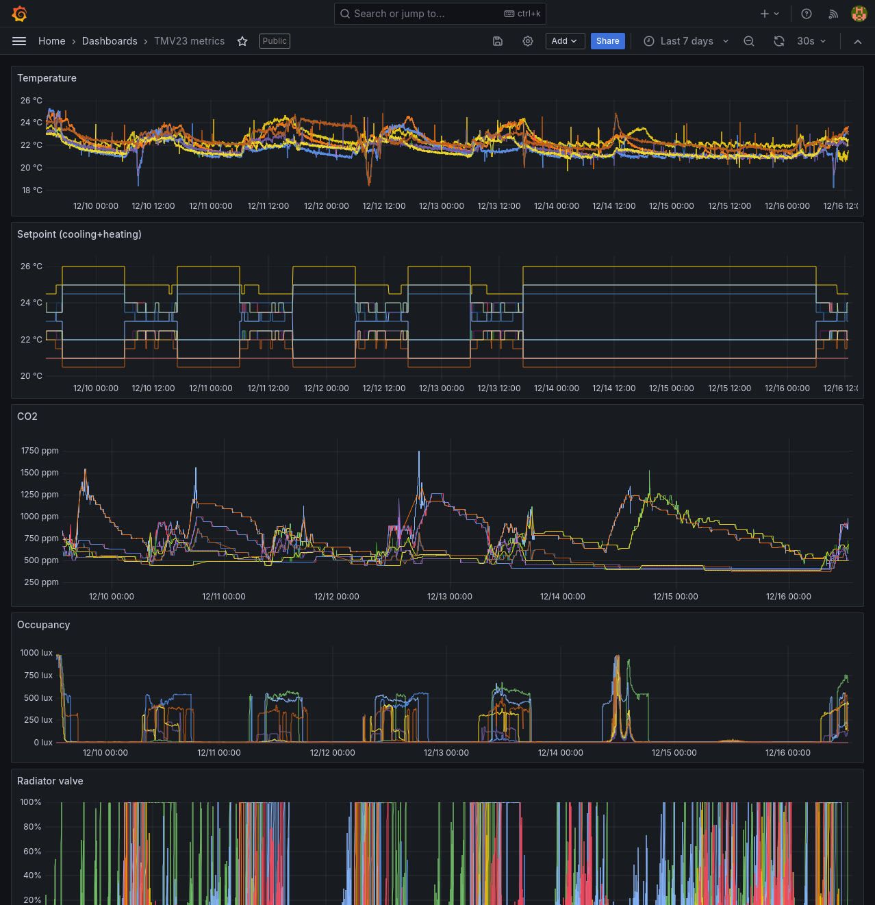

# ESUS-TMV23
Work-in-progress project on saving heating/cooling costs in the AAU TMV23 building.

The goal is to synthesise control strategies (Imran papers) for a subset of the TMV23 building and apply this through manipulating temperature-setpoints and actuating external window shades.
Presumed savings are among others from utilising weather forecasts and preemptively lowering shades in morning on sunny days to save cooling costs on south-facing rooms. Currently, these shades are not tied into the main BMS and are only controlled by human interaction.

Example of visualisation of production data in Grafana from BMS API:

# TODO:
- Fixup wrapper.out emission from systemd service (optional, not strictly necessary)
- Could enjoy some form of missing value detection with variable sampling-frequency time data. PoC: Just do upper bound of reasonable frame.

# Prod setup
- Assumes standard Ubuntu 24.04 VM (use e.g. Strato)
- Clone repo into `~`
- Setup `~/esus-tmv23/.env` with credentials and other vars
- Assumes paths used in `systemd/esus-wrapper.service`
    - Copy service to `/etc/systemd/system/esus-wrapper.service` on VM 
- Setup venv according to `requirements.txt`, e.g. `python3 -m venv venv`
- Setup docker (enable the systemd service) and `docker compose up -d` to start InfluxDB and Grafana
- Start+enable the wrapper `systemctl enable --now esus-wrapper`
- For exposing Grafana install `nginx` and copy `nginx/grafana` config to `/etc/nginx/sites-available/grafana`, activate the site within nginx, then start and enable the nginx systemd service for persistence

# Performance
- Reading from BMS API all measurements for one day takes ~1m20s. On 4 core VM, reading 30 days takes ~30m.
- Writing transformed points to local InfluxDB instance takes 16s to precompute, and 10s (preliminary) to write to db.
    - Extrapolating this means that we consume 1 time unit of computation per 1000 time units monitored. Polling once every 15 minutes (0/15/30/45 minutes + epsilon) can expose measurements as soon as they're available.

# Limitations
- Shades are not digitally controllable (LK svagstrømstryk installed) without custom hardware. 
- Main BMS (Schneider Electrics) is run on old bus which cannot handle much bandwidth. Limited to update frequency of ~5mins.

# Progress
- Refactor API to higher standard; error-handling, proper export of time-series, and speedup (python wrapper onto TMV23-internal BMS system) 
    - Have enabled high-frequency updates from API into CSV/pd.dataframe
- Setup InfluxDB container for ingesting datasource for visualising and identifying interesting points in time for acting on the heating system.
- Preliminary work into developing custom-panel interfacing with window-shade control switch.
    - Mechanical actuation parts, physical design, user-override mechanism conceptualised.
    - Perhaps possible to electrically (opposed to physically actuating) actuate on shades as they are max 24VDC (https://www.lavprisel.dk/lk-fuga-svagstroemstryk-4-slutte-1-modul-hvid-43923). Might be hard to convince Building Support.
